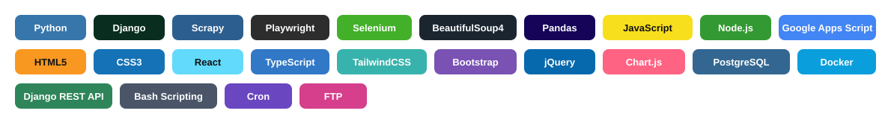

## Hi there, I'm Paul Tumabini 👋

Web Scraping Specialist & Full-Stack Developer

I build robust web scraping pipelines, automation tools, and scalable full-stack web apps using Python and JavaScript - turning raw data into action, from Django backends to Google Apps Script workflows.

## Tech Stack

## Featured Projects

- **Vehicle Data Web Scraper** - Django + Scrapy platform with 30+ spiders, Selenium/Playwright helpers, FTP pipeline, cron scheduling, and dashboard monitoring.  
  Repo: [vehicle-detail-page-scraper](https://github.com/paultumabini/vehicle-detail-page-scraper)

- **VDP Import Parser** - Python automation tool for parsing, transforming, and validating dealer inventory feeds before FTP ingestion.  
  Repo: [vdp-import-parser](https://github.com/paultumabini/vdp-import-parser)

- **Vehicle Data Monitoring** - Google Apps Script web app with auth/login, dashboard, and CRUD workflows for live operations.  
  Live: [Open app](https://script.google.com/macros/s/AKfycbwsvDezT1ZB9RGJqlueIUG_I0K_aFXda0mfVy01lknpqLUzr0PhB0T8xk2oWWO8Gz_qow/exec)

- **Lease Calculator Web App** - JavaScript app for monthly lease payment computation with live updates.  
  Repo: [lease-calculator](https://github.com/paultumabini/lease-calculator) | Live: [leasecalculator.netlify.app](https://leasecalculator.netlify.app/)

- **TaskaAI - AI Task Manager** - Full-stack DRF + React/Vite app with JWT auth, Kanban board, analytics, and AI-powered prioritization.  
  Repo: [taskaai-frontend](https://github.com/paultumabini/taskaai-frontend) | Live: [taskaai.vercel.app](https://taskaai.vercel.app)
